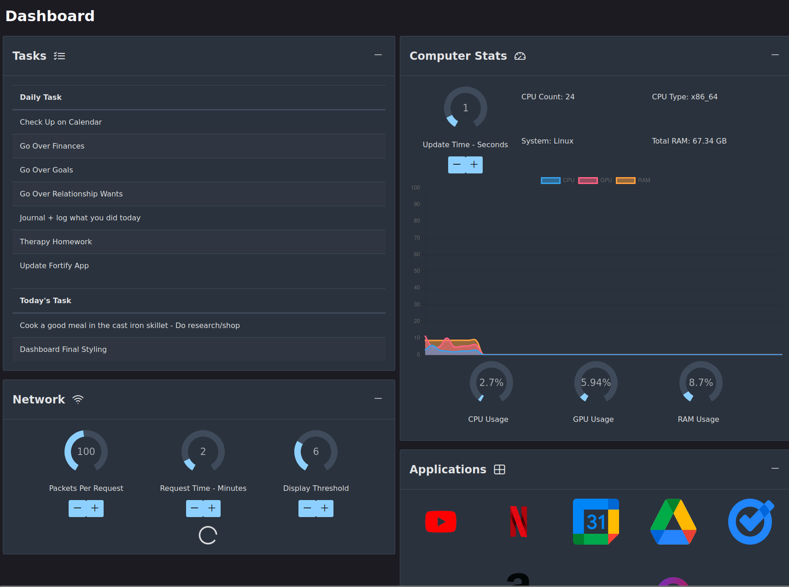

# Dashboard

## CI/CD

Implements CI/CD pipelines for both the backend and frontend components using the following:
 
<ul>
  <li>Front End Unit Tests Through Jasmine</li>
  <li>Postman Tests for Backend Where Needed</li>
  <li>Github Actions pipeline for linting and unit tests in the frontend.</li>
</ul>

## Bakend
Built in Python using Flask no database is used for now to keep the project more simple/not needed. Postman tests are made in the repo but are not ran in the pipeline due to the backend mostly calling outside sources so too many mocks would be needed.
 
<ul>
  <li>Google Tasks Endpoint</li>
  <li>Computer Stats Endpoint</li>
  <li>Network Stats Endpoint</li>
</ul>
 
Service: Service/dashboard_service.py
 
Postman Tests: Service/BackendPostmanTests.json
 
 
To run: <code>python3 Service/dashboard_service.py</code>

## Frontend
Built in Angular. Uses unit tests to test different components using Jasmine. There are four tabs on the frontend:
 
<ul>
  <li>Tasks</li>
  <li>Computer Stats</li>
  <li>Network</li>
  <li>Applications</li>
</ul>
 
To run: <code>ng serve --port {localPortNumber}</code>
 

